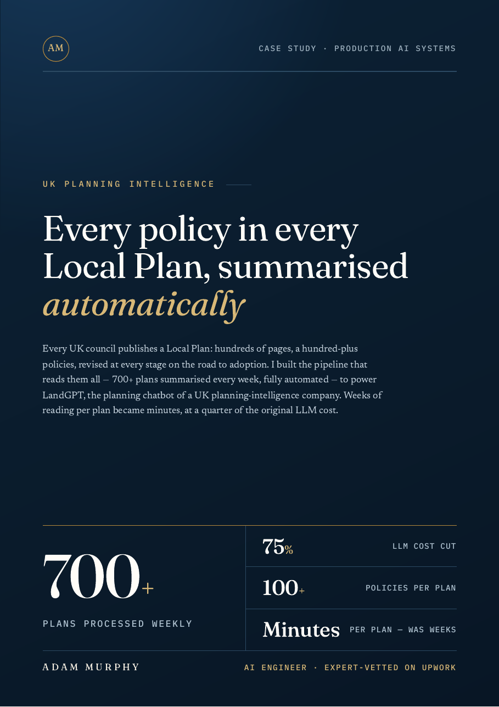
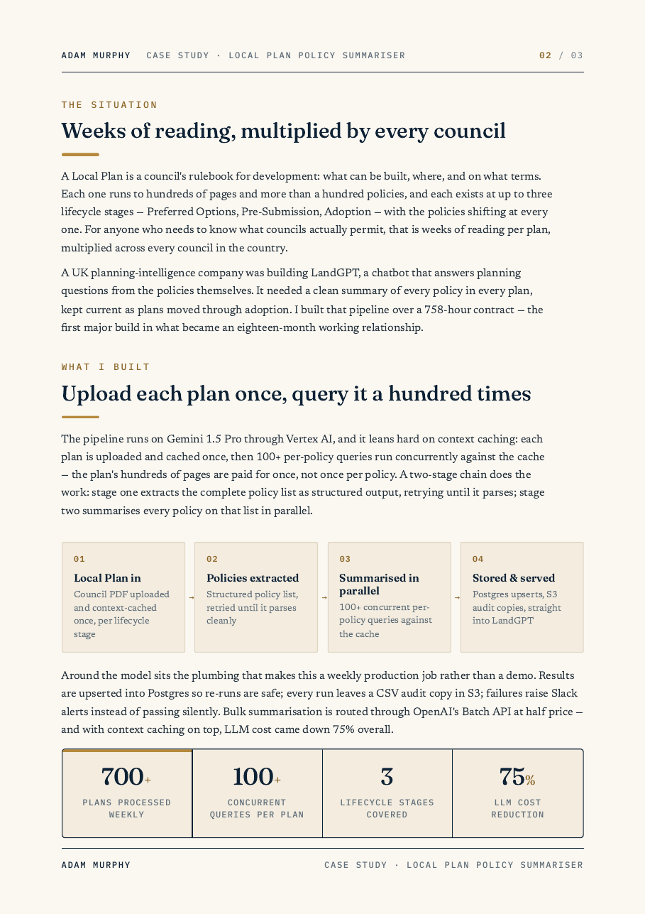
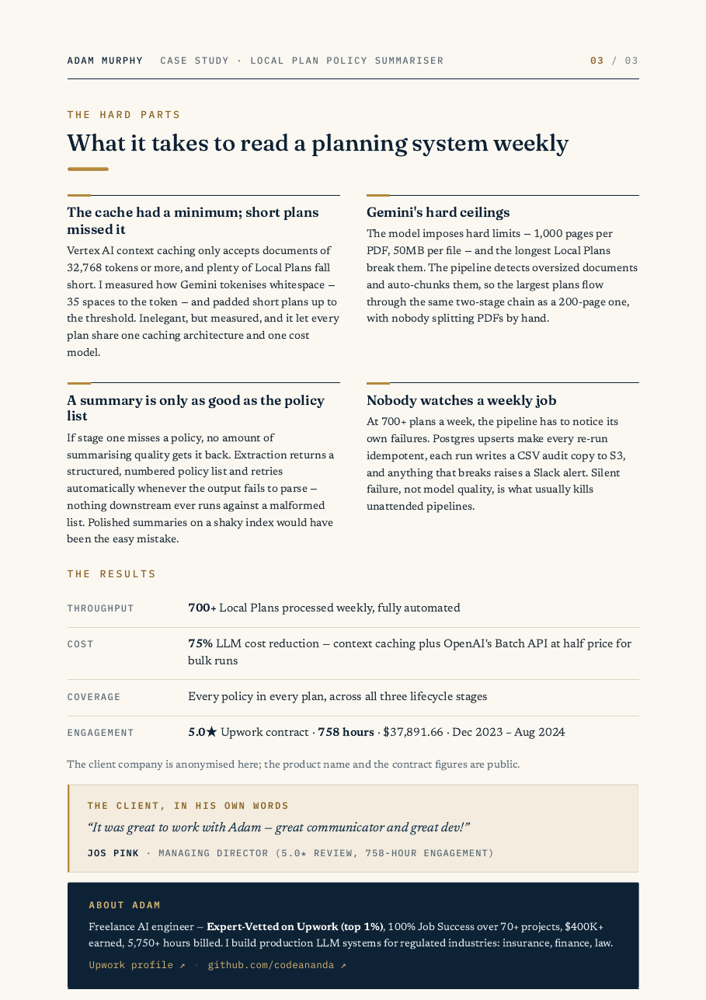

# Every policy in every Local Plan, summarised automatically

**700+ UK Local Plans summarised every week, fully automated — weeks of reading per plan became minutes, at a quarter of the original LLM cost.**

## At a glance

| Value | What it is |
| --- | --- |
| 700+ | Plans processed weekly |
| 75% | LLM cost cut |
| 100+ | Policies per plan |
| Minutes | Per plan, was weeks of reading |

## The situation

A Local Plan is a council's rulebook for development: what can be built, where, and on what terms. Each one runs to hundreds of pages and more than a hundred policies, and each exists at up to three lifecycle stages — Preferred Options, Pre-Submission, Adoption — with the policies shifting at every one.

For anyone who needs to know what councils actually permit, that is weeks of reading per plan, multiplied across every council in the country.

A UK planning-intelligence company was building LandGPT, a chatbot that answers planning questions from the policies themselves. It needed a clean summary of every policy in every plan, kept current as plans moved through adoption. I built that pipeline over a 758-hour contract — the first major build in what became an eighteen-month working relationship.

## What I built

The pipeline runs on Gemini 1.5 Pro through Vertex AI, and it leans hard on context caching: each plan is uploaded and cached once, then 100+ per-policy queries run concurrently against the cache — the plan's hundreds of pages are paid for once, not once per policy. A two-stage chain does the work: stage one extracts the complete policy list as structured output, retrying until it parses; stage two summarises every policy on that list in parallel.

| Step | What happens |
| --- | --- |
| Local Plan in | Council PDF uploaded and context-cached once, per lifecycle stage |
| Policies extracted | Structured policy list, retried until it parses cleanly |
| Summarised in parallel | 100+ concurrent per-policy queries against the cache |
| Stored & served | Postgres upserts, S3 audit copies, straight into LandGPT |

Around the model sits the plumbing that makes this a weekly production job rather than a demo. Results are upserted into Postgres so re-runs are safe; every run leaves a CSV audit copy in S3; failures raise Slack alerts instead of passing silently. Bulk summarisation is routed through OpenAI's Batch API at half price — and with context caching on top, LLM cost came down 75% overall.

## The hard parts

### The cache had a minimum; short plans missed it

Vertex AI context caching only accepts documents of 32,768 tokens or more, and plenty of Local Plans fall short. I measured how Gemini tokenises whitespace — 35 spaces to the token — and padded short plans up to the threshold. Inelegant, but measured, and it let every plan share one caching architecture and one cost model.

### Gemini's hard ceilings

The model imposes hard limits — 1,000 pages per PDF, 50MB per file — and the longest Local Plans break them. The pipeline detects oversized documents and auto-chunks them, so the largest plans flow through the same two-stage chain as a 200-page one, with nobody splitting PDFs by hand.

### A summary is only as good as the policy list

If stage one misses a policy, no amount of summarising quality gets it back. Extraction returns a structured, numbered policy list and retries automatically whenever the output fails to parse — nothing downstream ever runs against a malformed list. Polished summaries on a shaky index would have been the easy mistake.

### Nobody watches a weekly job

At 700+ plans a week, the pipeline has to notice its own failures. Postgres upserts make every re-run idempotent, each run writes a CSV audit copy to S3, and anything that breaks raises a Slack alert. Silent failure, not model quality, is what usually kills unattended pipelines.

## Results

| Metric | Result |
| --- | --- |
| Throughput | 700+ Local Plans processed weekly, fully automated |
| Cost | 75% LLM cost reduction — context caching plus OpenAI's Batch API at half price for bulk runs |
| Coverage | Every policy in every plan, across all three lifecycle stages |
| Engagement | 5.0★ Upwork contract · 758 hours · $37,891.66 · Dec 2023 – Aug 2024 |

The client company is anonymised here; the product name and the contract figures are public.

## What the client said

> "It was great to work with Adam — great communicator and great dev!"

— Jos Pink, Managing Director (5.0★ review, 758-hour engagement)

## The full case study

A designed PDF version of this case study is in this repo: [07-local-plan-summariser.pdf](07-local-plan-summariser.pdf).

---

## About Adam

Freelance AI engineer — Expert-Vetted on Upwork (top 1%), 100% Job Success over 70+ projects, $400K+ earned, 5,750+ hours billed. I build production LLM systems for regulated industries: insurance, finance, law.

- [Upwork profile](https://www.upwork.com/freelancers/~01153ca9fd0099730e)
- [GitHub](https://github.com/codeananda)
